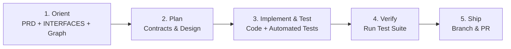

# Development Loop

> The workflow for developing features, fixing defects, and delivering changes.

## 1. The Core Loop



### 1. Orient
- Check [`docs/PRD.md`](docs/PRD.md) for product objectives and acceptance criteria.
- Check [`docs/INTERFACES.md`](docs/INTERFACES.md) for route and API contracts.
- Use Graphify (`query_graph`) or code search to understand affected components.

### 2. Plan
- Determine the minimal, elegant technical approach.
- If public APIs, routes, or models change, declare them in [`docs/INTERFACES.md`](docs/INTERFACES.md).

### 3. Implement & Test
- Implement functionality across service and surface boundaries with full-stack agency.
- Write tests (unit, integration, or contract) verifying behavior, edge cases, and preventing regressions.

### 4. Verify
- Run the automated test suite locally:
  ```bash
  uv run --with pytest pytest tests/ -q
  ```

### 5. Ship
- Create an ephemeral branch, make atomic commits with clear messages, and open a Pull Request to `main`.
