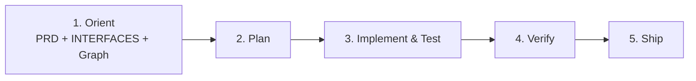

# Development Loop



### 1. Orient

- Read [`docs/PRD.md`](docs/PRD.md) and [`docs/INTERFACES.md`](docs/INTERFACES.md).
- Use Graphify (`query_graph`) before grepping.

### 2. Plan

- Keep the change small.
- If an entry point is added or removed, update [`docs/INTERFACES.md`](docs/INTERFACES.md).

### 3. Implement and test

- Change the skill, script, hook, or doc that owns the behavior.
- Add or adjust a test in `tests/` when the wiring can break silently.

### 4. Verify

```bash
uv run --with pytest pytest tests/ -q
```

### 5. Ship

- Ephemeral branch, conventional commit, pull request into `main`.
